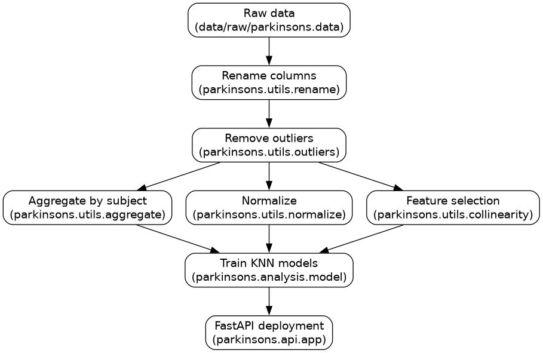

# Parkinson's Disease Modeling

This repository contains the complete workflow for modeling Parkinson's disease
progression using K-Nearest Neighbors (KNN) and integrating the final model
into a minimal API for real-time prediction.

## Introduction

Parkinson's disease (PD) is a progressive neurodegenerative disorder that
affected over 8.5 million people globally in 2019. Around 90% of individuals
with PD experience speech impairment, primarily hypokinetic dysarthria.
Detecting PD early through speech analysis can improve access to treatment and
may help slow disease progression. This project investigates the potential of
KNN for PD detection by training three models on cleaned, aggregated, and
normalized voice measurements.

## Methodology

The dataset includes voice measurements from 31 individuals across 195
recordings, labeled as healthy (0) or Parkinson's (1). The pipeline consists of
four preprocessing steps:

1. Renaming columns for consistency.
2. Removing outliers using the IQR method and replacing them with the
   per-subject mean.
3. Aggregating trials per subject by mean feature values.
4. Normalizing features with Min-Max scaling.

A correlation-based feature selection step retains the least correlated
features. The final feature set is: absJitter, apq, D2, DFA, HNR, maxFF, NHR,
PPE, RPDE, spread1, and spread2. Data is split into 70% training and 30%
testing, and the optimal k is selected where training and testing accuracy
intersect.

## Results

The normalized KNN model outperforms the others. Feature selection and
normalization improve both accuracy and stability. The trained model is
integrated into a FastAPI backend with an HTML/CSS/JavaScript frontend for
real-time predictions.

| Model    | Accuracy | Optimal k |
| -------- | -------- | --------- |
| df_clean | ~83%     | ~12       |
| df_avg   | low      | flat      |
| df_norm  | ~97%     | 4         |

## Conclusions

Normalization and feature selection substantially improve KNN performance for
PD detection. The averaged model underperforms, likely due to information loss
from aggregation. The API provides a user-friendly interface for model
selection, metric inspection, and prediction. Limitations include the small
dataset and binary classification only. Future work could expand the dataset,
integrate additional biomarkers, and support real-time clinical input.
